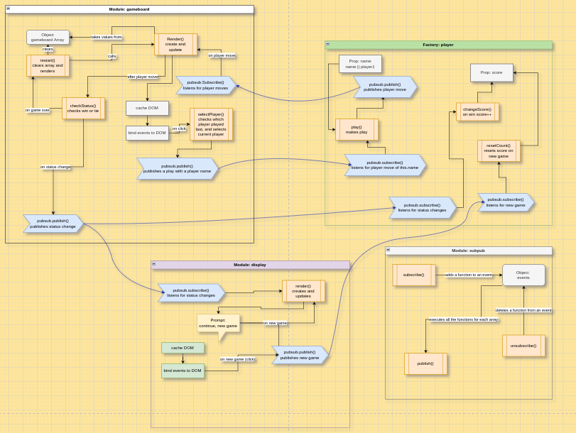

# tic-tac-toe project from TOP

## [Live demo](https://tomcoso.github.io/tic-tac-toe/)

## Process

1. Planning 

    Since this project's focus is on code organisation, I started by making a diagram (first time ever) of the modules i would use and how they would interact with each other.

    

    I decided to also implement a pubsub/mediator module, to handle the interaction between all the modules since I think its a valuable skill to have in making large projects clean. So this will be a learning experience in multiple fronts.

2. Basic UI

    I first started coding the modules but I quickly decided to build a rudimentary UI first so I could start isolatig and testing features

     

3. Gameboard Module

    I started coding in a scattered way, without real isolation or linear progression, which made everything more confusing. Lesson learned!. Decided to focus on making the gameboard work, coding the logic behind wins and ties, and alternating moves between players.

    

4. Display Module

    This time, I ended up making a list of all the isolated features i had to add one by one, and the list went by pretty fast. It was a great idea to isolate functionality and tackle it one at a time, while just writing down for later the bugs I found along the way that weren't involved in the specific feature I was working one. 

    

    I managed to implement most of the functionality of the game, but it is in possession of an unfortunately ugly UI. So that will be next before I try to implement an AI and some extra UX features.

5. (Slightly) Fancier Styling

    I created a palette with Coolors, I didn't know what I was looking for but I managed to create something I am happy about.

    

6. AI implementation

    I researched the minimax algorithm but I decided not to build it since AI is not the main goal of the TOP curriculum, I managed to get a basic understanding though but figured that building it would take me another 2 days or so.

    Instead I decided to simply build a random AI, where I could focus mostly on the AI implementation itself, which took around a day or so of work (6/8 hours?). Here again I was very glad I built that pubsub module in the beginning, it was the perfect tool to keep all the modules communicating and the global scope clean.

    #### Very basic diagram for the ai incorporation

    

    #### AI playing against me

    

